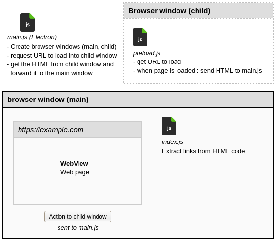

### Sample Web Scraping With Electron

This is a simple project to show tips for scraping web pages with an Electron app. 
It can help you to build a user friendly, portable application with a GUI, to scrape a specific web site.

Please read : 

- https://en.jeffprod.com/blog/2019/web-scraping-with-electron/ (EN)
- https://fr.jeffprod.com/blog/2019/web-scraping-avec-electron/ (FR)



#### Install

Install [NodeJS](https://nodejs.org/) then :

```bash
git clone https://github.com/Tazeg/sample-web-scraping-with-electron.git
cd sample-web-scraping-with-electron
npm install
npm run start
```
